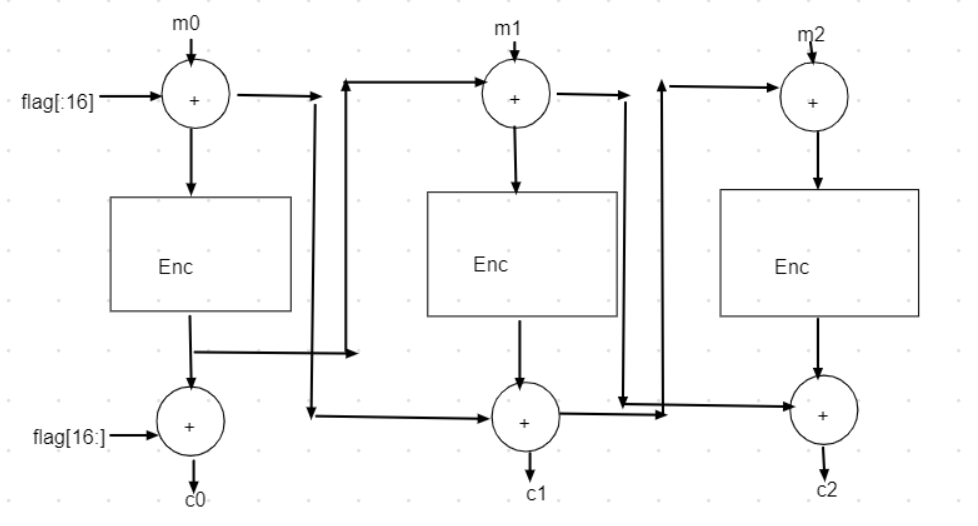

The key is corrupted, but that's just 3 characters. The ciphertext is mostly corrupted, but in the last block, only 2 characters are corrupted. And the first block is intact. This is just a modification of CBC.



Here's the ugly exploit script.

```
from Crypto.Util.Padding import pad
from Crypto.Cipher import AES
from Crypto.Util.strxor import strxor
import binascii

def good_string(s):
    for a in s:
        if a >= 128:
            return False
    return True

key_corrupted = '0▒9d0fe1920ca▒85e3851b162b8cc9▒5'
key_hex = ""
for char in key_corrupted:
    if ord(char) >= 128:
        key_hex+='?'
    else:
        key_hex+=char

msg = 'If Bruce Schneier multiplies two primes, the product is prime. On a completely unrelated note, the key used to encrypt this message is '
#key = binascii.unhexlify(key_hex)

ciphertext_corrupted = 'ed5dd65ef5ac36e886830cf006359b300▒1▒▒7▒▒▒▒▒▒c▒▒▒▒▒a▒▒▒▒▒8▒▒▒▒▒▒▒d6▒▒▒▒▒7▒▒▒▒b▒▒▒▒2▒▒▒▒▒▒▒▒▒f▒d▒0▒▒▒▒▒▒▒▒▒▒▒▒▒▒▒▒▒▒▒▒▒▒6▒▒▒▒▒▒▒▒▒▒▒▒▒f▒▒▒▒▒▒▒▒▒▒▒▒▒▒▒▒▒▒▒▒▒d▒▒b▒▒▒a▒▒▒▒▒e▒▒c▒▒▒▒▒2▒▒▒▒▒▒▒▒▒▒0▒▒3▒0c▒▒f▒▒▒▒▒▒▒▒▒▒▒▒1▒▒7▒▒▒▒▒▒▒▒▒▒▒▒▒1e▒▒0▒0▒▒▒▒▒9▒▒c▒▒e▒▒2▒▒4▒▒▒▒7▒▒▒▒▒0▒▒▒▒▒4▒▒▒▒▒▒▒▒f▒▒▒7▒▒▒▒▒e▒b▒▒9▒▒▒▒4▒f▒▒1▒c▒▒6▒0a▒3a0e6▒d7▒975d▒1cde66e41791b▒780988c9b8329'
ciphertext_hex = ""
for char in ciphertext_corrupted:
    if ord(char) >= 128:
        ciphertext_hex+='?'
    else:
        ciphertext_hex+=char

alphabets = "0123456789abcdef"

for char_1 in alphabets:
    for char_13 in alphabets:
        for char_30 in alphabets:
            key_hex = key_hex[0:1] + char_1 + key_hex[2:13] + char_13 + key_hex[14:30] + char_30 + key_hex[31:32]
            key = binascii.unhexlify(key_hex)
            plaintext = msg + key_hex
            plaintext = (plaintext + '\t'*9).encode()
            for cipher_324 in alphabets:
                for cipher_338 in alphabets:
                    ciphertext_hex = ciphertext_hex[0:324] + cipher_324 + ciphertext_hex[325:338] + cipher_338 + ciphertext_hex[339:]
                    plaintext_blocks = [plaintext[i:i+16] for i in range(0, len(plaintext), 16)]
                    ciphertext_blocks = [ciphertext_hex[i:i+32] for i in range(0, len(ciphertext_hex), 32)]
                    for block_index in range(len(ciphertext_blocks)-1, 1, -1):
                        ciphertext_blocks[block_index-1] = strxor(strxor(AES.new(key, AES.MODE_ECB).decrypt(strxor(binascii.unhexlify(ciphertext_blocks[block_index]),plaintext_blocks[block_index-1])), plaintext_blocks[block_index]), plaintext_blocks[block_index-2]).hex()
                    flagpart1 = strxor(strxor(AES.new(key, AES.MODE_ECB).decrypt(strxor(binascii.unhexlify(ciphertext_blocks[1]),plaintext_blocks[0])), plaintext_blocks[1]), binascii.unhexlify(ciphertext_blocks[0]))
                    flagpart2 = strxor(AES.new(key, AES.MODE_ECB).decrypt(strxor(binascii.unhexlify(ciphertext_blocks[0]), flagpart1)), plaintext_blocks[0])
                    if good_string(flagpart1) and good_string(flagpart2):
                        print(flagpart2+flagpart1)
```

```
Flag: DUCTF{IVs_4r3nt_s3cret!_but_fl4gs_ar3!}
```