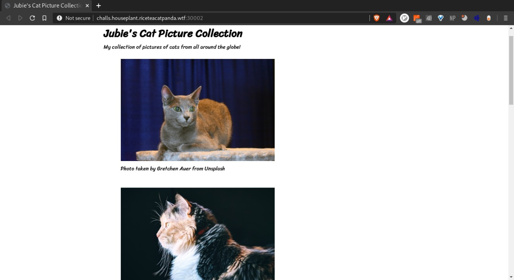
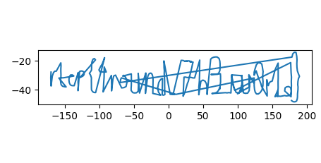

# Catography
OSINT, 1,547 points

## Description
Jubie's released her own collection of cat pictures. Go check it out!

http://challs.houseplant.riceteacatpanda.wtf:30002

Note: The Unsplash author credit is not a part of the challenge, it's only there to conform with the Unsplash image license.



## Solution
The first clue was in the name, catography was similar to cartography. So, something to do with maps. The Admin said that all the images would be needed and so i set to scrape the api, download them all.
After downloading the pics, i tried strings, exiftool on all the pics. No luck.
Now, i had an idea to map all the locations of the images on a map. So, parsed all the locations from the images.   
`exiftool *.jpg >> loc`

Then a little python script to map the locations
```
import matplotlib.pyplot as plt
with open("loc",'r') as p:
    o = p.read().split("\n")
lat = []
long1 = []
for i in o:
    #lat
    l = i.split(" ")
    lat.append(-1*(float(l[0])+float(l[2].split("'")[0])/60 + float(l[3].split('"')[0])/3600))
    ans = float(l[5])+ float(l[7].split("'")[0])/60+float(l[8].split('"')[0])/3600
    if l[9]=='W':
        long1.append(ans*-1)
    else:
        long1.append(ans)
plt.plot(long1, lat)
plt.show()
```

## Flag
>rtcp{4round_7h3_w0r1d}
